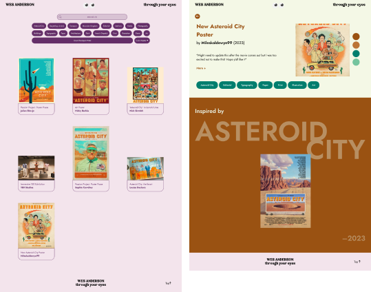
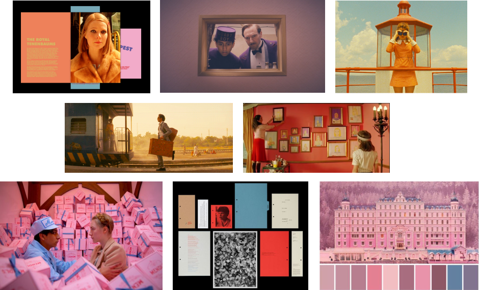

# Wes Anderson through your eyes
Online archive showcasing a curated collection of diverse projects influenced by the unique cinematic style of director Wes Anderson.

[Link to website](https://leonordd.github.io/DW-Project/)

    

### Motivation
Presenting the public with a curation of content set in Wes Anderson's cinematic universe, as well as other forms of art inspired by and reminiscent of the director's unique aesthetic, from puzzles, games, photography, paintings, editorial work, among others.

### Audience

It is aimed at anyone interested in the cinematographic work of director Wes Anderson. Lovers of art, cinema and photography, or anyone interested in learning more about this director's unique signature.

### Moodboard

    

###### Technologies
- HTML
- CSS
- Javascript
- [CosmicJS](https://www.cosmicjs.com/)

###### Deployment
- GitHub Pages

###### Acknowledgments

A big thank you to the talented artists whose works are featured in this archive for their creativity and inspiration.
All works presented on this website are the intellectual property of their respective creators. Each piece is accompanied by appropriate attribution, and, where applicable, links are provided to redirect users to the original reference website.

